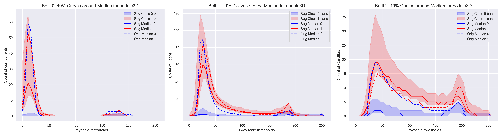

# 🧠 TopoCAM: ROI-Driven Topological Signatures in Medical Imaging

TopoCAM is a modular framework that combines explainable deep learning with topological data analysis (TDA) for interpretable and robust medical image classification. It supports both **3D volumetric scans** and **2D grayscale images**, and has been validated across multiple MedMNIST and BraTS benchmarks.

---

## 🔍 Motivation

Deep learning models often struggle with interpretability and robustness in clinical settings, especially under limited supervision. TopoCAM addresses this by:

- Localizing class-discriminative regions using **multi-scale Grad-CAM**
- Segmenting the input image/volume based on fused attention maps
- Computing **Betti curves** via cubical persistent homology
- Classifying topological descriptors using a lightweight MLP

This approach filters out irrelevant anatomy and concentrates analysis on clinically meaningful structures.

---

## 🧩 Pipeline Overview

We define the pipeline as $\hat{y} = g_\psi \circ \phi \circ A_{w,\tau} \circ f_\theta(\mathbf{X})$.

Where:
- `f_θ`: Pretrained CNN backbone (ResNet-18 for 2D, R3D-18 for 3D)
- `A_{w,τ}`: Weighted Grad-CAM fusion and thresholding
- `φ`: Betti curve computation from segmented input
- `g_ψ`: MLP classifier trained on topological features

### 📌 Full Pipeline Visualization

> The figure below illustrates the complete TopoCAM workflow applied to 3D brain MRI scans. It shows input slices, feature extraction via 3D ResNet-18, binary segmentation, and downstream analysis using topological descriptors.

---

## 📦 Datasets

Experiments are conducted on:

- **3D**: NoduleMNIST3D, FractureMNIST3D, SynapseMNIST3D, BraTS 2019/2021, Harvard OCT
- **2D**: BreastMNIST, PneumoniaMNIST

All inputs are resized to standardized shapes (e.g., 64×64×64 for 3D, 224×224 for 2D), and grayscale images are replicated to 3 channels for compatibility with pretrained CNNs.

---

## 📈 Performance Highlights

TopoCAM consistently outperforms CNN and ViT baselines across both 2D and 3D benchmarks:

| Dataset           | TopoCAM AUC | TopoCAM Accuracy |
|------------------|-------------|------------------|
| BreastMNIST       | 99.9        | 98.7             |
| PneumoniaMNIST    | 100.0       | 99.4             |
| FractureMNIST3D   | 99.6        | 98.1             |
| BraTS 2019        | 94.2        | 98.5             |
| Harvard OCT       | 78.4        | 81.4             |

---

## 📊 Interpretability via Topology

TopoCAM improves interpretability by focusing on class-relevant regions and summarizing their geometric complexity. The following figures illustrate this:

### 📈 Figure 5: Betti Curves from Original vs. Segmented Volumes

> ROI-based Betti curves show reduced variance and clearer class separation compared to full-volume topology.

---

### 🧬 Figure 6: t-SNE Visualization of Betti Vectors

> Topological descriptors from segmented regions yield tighter clustering and better class separability.

---

## 🛠️ Implementation Notes

- CNN backbones: `resnet18` (2D), `r3d_18` (3D), pretrained on ImageNet/Kinetics-400
- Grad-CAM fusion weights are optimized via **differential evolution** to maximize AUC
- Topological features are computed using **Giotto-TDA**
- MLP classifiers are shallow and efficient, trained with cross-entropy loss

---

## 📁 Folder Structure
TopoCAM/
├── 2D_Model.py
├── 3D_Model.py
├── Nodule_betti_comparison_all_three.png
├── TopoCAM_3.png
├── nodule_tsne_comparison_plot.png
├── synapse_betti_comparison_all_three.png
├── synapse_tsne_comparison_plot.png
├── README.md
